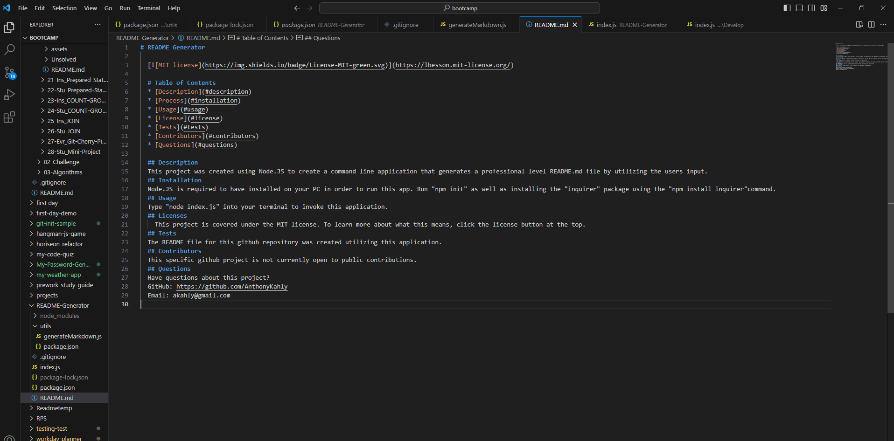

# README Generator
  

  # Table of Contents
  * [Description](#description)
  * [Process](#installation)
  * [Usage](#usage)
  * [License](#license)
  * [Tests](#tests)
  * [Contributors](#contributors)
  * [Questions](#questions)

  ## Description
  This project was created using Node.JS to create a command line application that generates a professional level README.md file by utilizing the users input.
   
  ## Installation
  Node.JS is required to have installed on your PC in order to run this app. Run "npm init" as well as installing the "inquirer" package using the "npm install inquirer"command.
  ## Usage
  Type "node index.js" into your terminal to invoke this application.
  ## Licenses
    This project is covered under the MIT license. To learn more about what this means, click the license button at the top.
  ## Tests
  The README file for this github repository was created utilizing this application.
  ## Contributors
  This specific github project is not currently open to public contributions.
  ## Questions
  Have questions about this project?  
  GitHub: https://github.com/AnthonyKahly  
  Email: akahly@gmail.com
